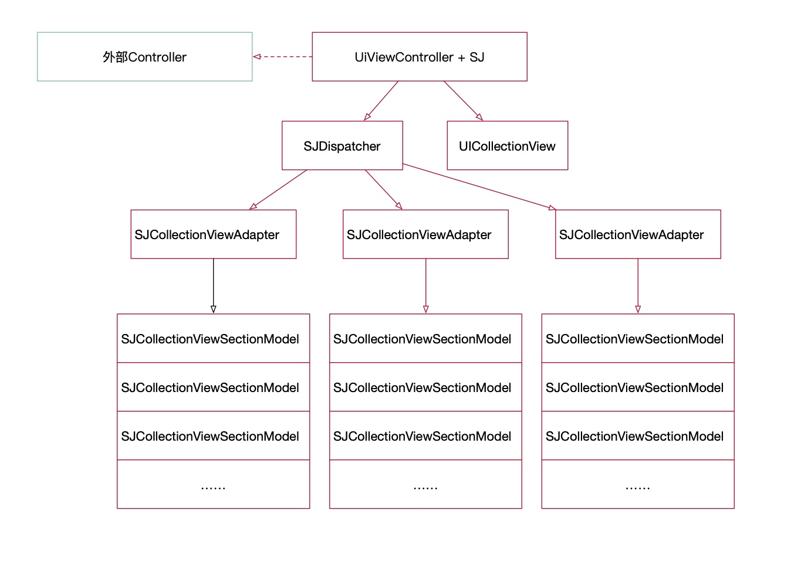

# SJListkit

## Example

To run the example project, clone the repo, and run `pod install` from the Example directory first.

### 架构设计
##### 整体架构设计

- 外部Controller 不需要继承，引入分类就有了全部的VC的功能。
- 页面显示考数据驱动，组装SJCollectionViewAdapter 子类实例对象，内部装填SJCollectionViewSectionModel 数组，这个是collectionView 的section对应的模型。加工好的数据调用**addAdapter：**函数就可以自动生成界面了。
- 控制页面显示大小的代理方法，也经过了内部分发，确定了优先级。对于cell来讲，优先级 cellModel > sectionModel >  adapter > 外部传入VC 

#### adapter 之间的通信
设计adapter的初衷除了将不同的类型的section 隔离开来，将本来放在控制器里的逻辑移到adapter中来，另一个出发点是希望不同的adapter之间能够建立通信功能，一旦每个adapter中的逻辑复杂起来，这种通信是必要的。


SJServiceMacro 是一个定义的宏，这个宏使得adapter 之间的通信只需要一行代码就能解决。


#### SJServiceCenter 

内部adapter的存储，_notifyCenter 和 _clientCenter 是一个NSMapTable (dictionary 的通用类型)对象，对内部持有对象是weak引用，  _notifyCenter 中对同一个key保存的实例，使用NSHashTable（set 的通用类型）。保证使用方不需要额外处理内存问题，serviceCenter 不会有额外的引用。

#### SJMessageInterceptor 
消息转发妙用
在**SJDispatcher**中，需要去分发消息 分别给adapter 和 外部的Controller，使用SJMessageInterceptor 的消息转发，根据配置转发的优先级，以简化代码。

```
- (id)forwardingTargetForSelector:(SEL)aSelector {
    if ([firstInterceptor respondsToSelector:aSelector]) { return firstInterceptor; }
    if ([secondInterceptor respondsToSelector:aSelector]) { return secondInterceptor; }
    return [super forwardingTargetForSelector:aSelector];
}

- (BOOL)respondsToSelector:(SEL)aSelector {
    if ([firstInterceptor respondsToSelector:aSelector]) { return YES; }
    if ([secondInterceptor respondsToSelector:aSelector]) { return YES; }
    return [super respondsToSelector:aSelector];
}
```
根据优先级判断代码就变得很简单了

```
- (CGSize)collectionView:(UICollectionView *)collectionView layout:(UICollectionViewLayout*)collectionViewLayout sizeForItemAtIndexPath:(NSIndexPath *)indexPath
{
    [self updateInterceptorWithIndexPath:indexPath];
    if ([self.interceptor respondsToSelector:_cmd]) {
        return [self.interceptor collectionView:collectionView layout:collectionViewLayout sizeForItemAtIndexPath:indexPath];
    }
    
    return CGSizeMake(0, 0);
}
```

### 使用例子
使用方只需要关心数据
```
    self.adapter1 = [[MCAdapter1 alloc]init];
    self.adapter1.collectionView = [self getCollectionView];
    [self buildData1];

    self.adapter2 = [[MCAdapter2 alloc]init];
    self.adapter2.collectionView = [self getCollectionView];
    [self buildData2];

    [self addAdapter:@[self.adapter1,self.adapter2]];
```


adapter之间的通信体现在点击adapter2中的绿色按钮，adapter1 中的section 会减少。

## Author

suquan, suzhengquan@suzhengquan.cn

## License

SJListkit is available under the MIT license. See the LICENSE file for more info.
